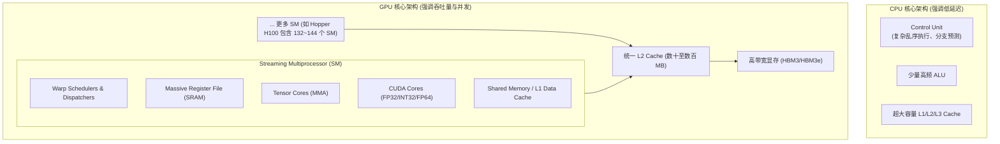
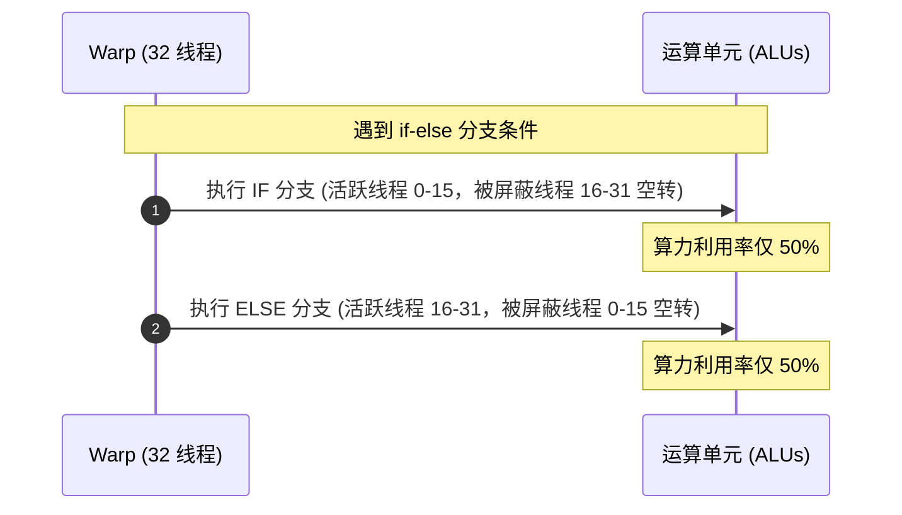

# 模块 1：GPU 微架构与 SM 计算模型

> **本章重点**：流式多处理器（SM）内部微架构、SIMT 执行模型、Warp 调度与分支分化代价、Tensor Core 混合精度矩阵计算。

---

## 1. 架构总览：从 CPU 到 GPU 的设计范式转换



---

## 2. 核心机制剖析

### 2.1 SM (Streaming Multiprocessor) 内部解构
SM 是 GPU 硬件上真正执行计算的基本物理单元。以 NVIDIA Hopper (H100) 架构为例，单个 GPU 拥有高达 132~144 个 SM。
- **Warp Scheduler & Dispatch Unit**：每个 SM 被划分为 4 个处理子块（Processing Blocks），每个子块包含专用的 Warp 调度器和分发单元，负责在单时钟周期内无开销地切换就绪的 Warp。
- **Register File（寄存器堆）**：SM 内集成超大规模 SRAM（通常为 64K 个 32-bit 寄存器，约 256KB/SM）。每个线程拥有独立的寄存器分配，无需在线程切换时将上下文压栈到主存。
- **Tensor Cores**：专用于矩阵乘累加（Matrix Multiply-Accumulate, MMA: $D = A \times B + C$）的高性能硬件电路，支持 FP16, BF16, FP8, INT8 和 INT4。

### 2.2 SIMT 执行模型与 Warp Divergence
- **Warp**：硬件执行的最小原子单位，由 32 个逻辑线程组成。同一个 Warp 内的 32 个线程在同一个时钟周期内执行相同的指令（SIMT: Single Instruction, Multiple Threads），但操作不同的数据。
- **Warp Divergence（分支分化）**：
  若代码中出现 `if (threadIdx.x % 2 == 0)`，Warp 内部的 32 个线程将无法同步执行。GPU 硬件只能串行执行 `if` 分支（屏蔽奇数线程）再执行 `else` 分支（屏蔽偶数线程），导致计算吞吐直接腰斩（50% 空转）。



---

## 3. K8s 资深工程师视角的心智模型映射

| Kubernetes 概念 | GPU 硬件 / 计算模型概念 | 本质机制对比 |
| :--- | :--- | :--- |
| **Worker Node** | **GPU Device (Chip)** | 承载所有计算资源的实体，对外提供标准化算力池。 |
| **Kubelet** | **GigaThread Engine** | 负责将任务分配到各个执行单元，协调全局资源生命周期。 |
| **CPU Core / Pod** | **SM (Streaming Multiprocessor)** | 真正独立隔离的物理运算核心。 |
| **OS Thread / Goroutine** | **Thread & Warp** | GPU 线程比 OS 线程轻量得多，32 个线程绑定为 1 个 Warp 硬件协同执行。 |
| **cgroups CPU Quota** | **SM Occupancy** | 调度到 SM 上的活跃 Warp 占最大支持 Warp 数量的比例，决定了延迟隐藏能力。 |

---

## 4. 动手实操与排查命令

```bash
# 查看本地 GPU 架构信息与 SM 数量
nvidia-smi --query-gpu=gpu_name,compute_cap,gpu_uuid,driver_version --format=csv

# 检查当前驱动支持的 CUDA 版本
nvidia-smi

# 编译并使用 Nsight Compute (ncu) 诊断 Warp 活跃度与 Occupancy
# ncu --metrics sm__warps_active.avg.pct_of_peak_sustained_active ./your_cuda_kernel
```

---

## 5. 核心思考题
1. 为什么 CUDA 编程中常建议 Thread Block 大小设置为 32 的整数倍（如 128、256）？
2. 什么是 Tensor Core 的 Transformer Engine（如 FP8 动态量化），它与传统 FP16 Tensor Core 相比在吞吐和精度上有何本质权衡？
