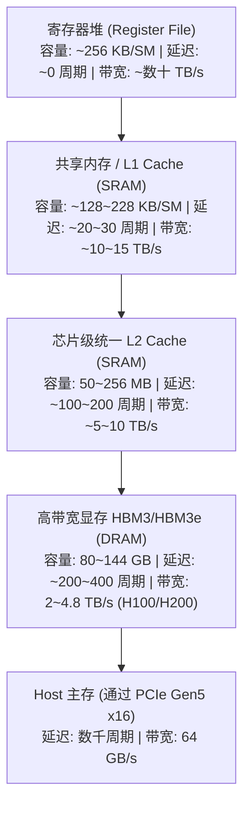
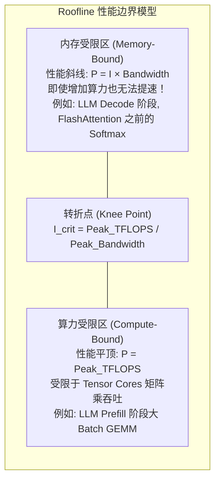

# 模块 2：显存层级、带宽瓶颈与 Roofline 模型

> **本章重点**：GPU 显存物理金字塔、SRAM vs HBM、Bank Conflict、算术强度（Arithmetic Intensity）、Roofline 性能模型数学边界。

---

## 1. 显存物理金字塔与访问延迟



---

## 2. 核心机制剖析

### 2.1 算术强度 (Arithmetic Intensity) 与 Roofline 模型
衡量一个算子（Kernel）性能上限的物理准绳是 **Roofline 模型**：
$$\text{可达算力 } P = \min(P_{\text{peak}}, I \times B_{\text{mem}})$$
- $P_{\text{peak}}$：GPU 的理论峰值浮点算力（TFLOPS）。
- $B_{\text{mem}}$：GPU 的峰值显存带宽（TB/s）。
- $I$：算术强度（Arithmetic Intensity），定义为 $\frac{\text{计算浮点操作数 (FLOPs)}}{\text{显存访存量 (Bytes)}}$。



### 2.2 共享内存 (Shared Memory) 与 Bank Conflict
- Shared Memory 位于芯片上的 SRAM 中，访问延迟极低。
- 物理上划分为 32 个等宽的 Memory Banks（每个 Bank 4 字节）。
- **Bank Conflict**：当同一个 Warp 内的多个线程同时访问同一个 Bank 内不同地址的数据时，硬件请求会被强制串行化，导致 Shared Memory 带宽严重缩水。

### 2.3 显存合并访存 (Coalesced Access)
Warp 内 32 个线程发起的全局内存读写，若地址是连续对齐的，硬件只需发起 1~2 次 32/64/128-byte 的 Cache Line 事务即可完成加载。如果线程访问跨步（Strided）或离散（Random），会触发大量冗余的数据搬运，将有效 HBM 带宽打碎。

---

## 3. K8s 资深工程师视角的心智模型映射

| Kubernetes / 分布式系统概念 | GPU 显存系统概念 | 机制相似性 |
| :--- | :--- | :--- |
| **本地 CPU L1/L2 Cache** | **Shared Memory (SRAM)** | 极小容量、超高带宽，要求开发者或运行时显式规划与分块（Tiling）。 |
| **节点本地 NVMe SSD** | **HBM3e 全局显存** | 空间容量较大，但成为整个计算流水线的主 IO 瓶颈。 |
| **网络跨节点跨机架 RPC** | **PCIe Host-to-Device 搬运** | 跨越总线边界，延迟陡增，应尽量避免或采用异步流式批处理隐藏。 |
| **I/O Wait (iowait) 导致 CPU 空转** | **Memory Stalls 导致 Warp 挂起** | 计算单元处于等待数据返回的饥饿状态。 |

---

## 4. 动手实操与排查命令

```bash
# 查看当前 GPU 的显存容量、已用显存与显存总带宽规格
nvidia-smi --query-gpu=name,memory.total,memory.used,memory.free --format=csv

# 检查当前节点 PCIe 链路协商速度与宽度（确保跑在 Gen5 x16）
sudo lspci -vvv -d 10de: | grep -E "LnkCap|LnkSta"

# 使用 dcgmi 监控显存控制器利用率
dcgmi dmon -e 203,204,210,211
```

---

## 5. 核心思考题
1. 为什么在大模型推理的自回归 Decode 阶段，即使 Batch Size 为 1，显卡利用率（`nvidia-smi` 看到的 GPU%）很高，但实际利用的 Tensor Core 算力却不到 5%？
2. FlashAttention 是如何利用 SRAM（Shared Memory）重排 Attention 计算图，从而打破 HBM 访存带宽瓶颈的？
