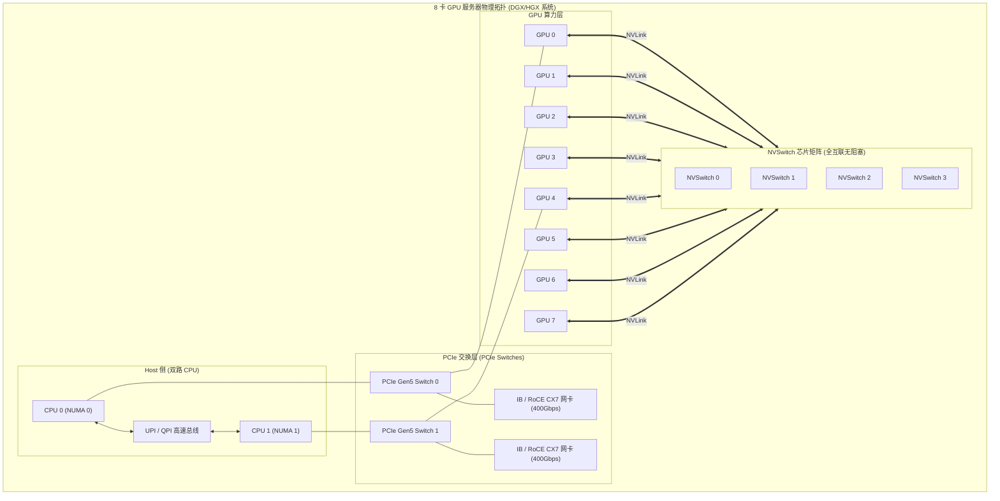
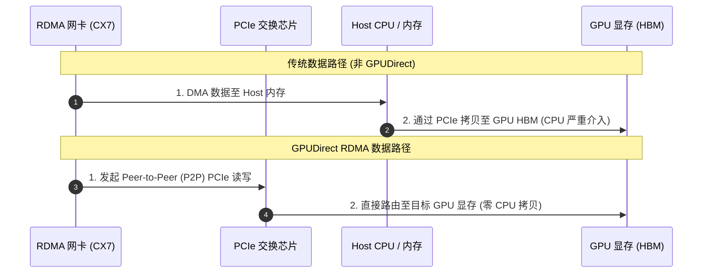

# 模块 3：片间高速互联与通信拓扑

> **本章重点**：PCIe 总线协议与瓶颈、NVLink 协议与带宽演进、NVSwitch 8 卡全互联矩阵、Scale-out 网络（InfiniBand / RoCE）、GPUDirect RDMA 原理。

---

## 1. 互联拓扑全貌：从片内到集群



---

## 2. 核心机制剖析

### 2.1 PCIe vs NVLink 带宽悬殊
- **PCIe Gen5 x16**：单向带宽 32 GB/s，双向带宽 64 GB/s。
- **NVLink 4 (Hopper H100)**：单 GPU 拥有 18 条 NVLink 4 链路，聚合双向带宽高达 **900 GB/s**（相当于 PCIe 5.0 的 14 倍！）。
- **NVLink 5 (Blackwell B200)**：聚合双向带宽进一步跃升至 **1.8 TB/s**。

### 2.2 NVSwitch 物理架构
在典型的 8 卡服务器中，单靠 GPU 之间的直连连线（Point-to-Point）无法在每两张卡之间都提供满带宽。
- NVSwitch 充当片间交叉开关（Crossbar Switch），所有 8 张 GPU 的 NVLink 统一接入 NVSwitch 芯片阵列。
- 任意两个 GPU 之间的点对点通信均能跑满 900 GB/s 的全双工无阻塞带宽。

### 2.3 GPUDirect RDMA
传统网络接收数据流程：网卡 $\rightarrow$ DMA 到内核 Host 内存 $\rightarrow$ 拷贝到用户态内存 $\rightarrow$ 经 PCIe DMA 到 GPU 显存（涉及多次 CPU 参与和内存复制）。
- **GPUDirect RDMA**：网卡控制器直接通过 PCIe 总线（Peer-to-Peer DMA）向 GPU 显存写入数据，完全绕过 CPU、Host 操作系统内核与 Host 内存。



---

## 3. K8s 资深工程师视角的心智模型映射

| Kubernetes 概念 | GPU 通信拓扑概念 | 映射本质 |
| :--- | :--- | :--- |
| **K8s Pod 跨节点网络 (Over-the-overlay CNI)** | **PCIe 跨 CPU Socket 通信** | 存在明显的通信跳数（Hops）与带宽瓶颈。 |
| **同 Pod 容器间 Localhost 通信** | **同节点 NVSwitch 全互联通信** | 共享高速互联，无路由协议额外损耗。 |
| **Node 拓扑与可用区 (Topology Spread Constraints)** | **NUMA 与 PCIe 亲和性 (TopologyManager)** | 调度器若把紧密协作的进程拆到跨 NUMA 的 GPU 上，性能将面临断崖。 |

---

## 4. 动手实操与排查命令

```bash
# 查看当前节点 8 卡之间的硬件连接矩阵 (NVLink, PCIe, NUMA)
nvidia-smi topo -m

# 检查当前系统是否识别到 NVSwitch 物理设备
lspci -d 10de: | grep -i switch

# 测试两两 GPU 之间的点对点 P2P 带宽与延迟
# /usr/local/cuda/samples/1_Utilities/p2pBandwidthLatencyTest/p2pBandwidthLatencyTest
```

---

## 5. 核心思考题
1. 为什么在运行大模型张量并行（Tensor Parallelism, TP）时，必须严格要求在同一个 NVLink 域内（如单机 8 卡以内），而不能跨以太网节点？
2. 如果 K8s 节点同时拥有 2 张网卡和 8 张 GPU，如何确保 Pod 绑定的 GPU 与其使用的网卡处于同一个 NUMA 节点与 PCIe Switch 下？
