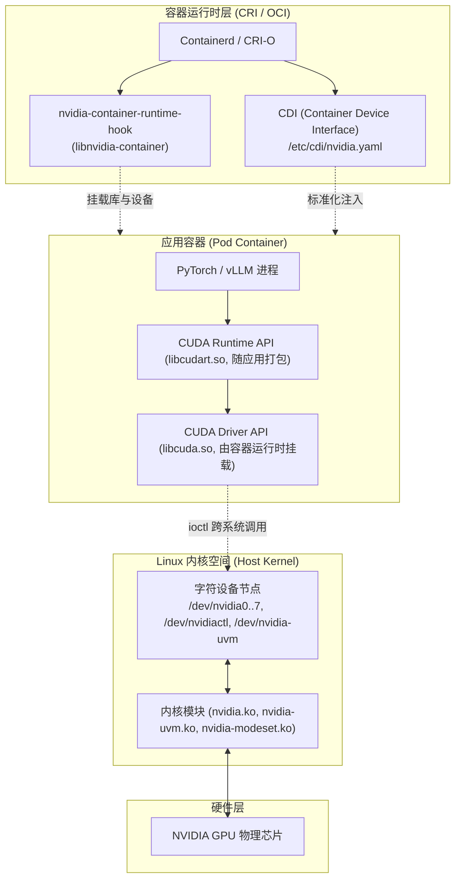

# 模块 4：从内核驱动到容器设备交付

> **本章重点**：Linux 内核驱动体系（`nvidia.ko` / `nvidia-uvm.ko`）、`/dev/nvidia*` 字符设备与 ioctl、CUDA Driver vs Runtime API、`nvidia-container-toolkit` 注入机制与 CDI 标准规范。

---

## 1. 容器交付链路全景图



---

## 2. 核心机制剖析

### 2.1 内核模块与字符设备
- **`nvidia.ko`**：核心驱动模块，负责与物理 GPU 芯片通信，管理寄存器映射与中断。暴露 `/dev/nvidia0` ~ `/dev/nvidiaN`（单卡设备节点）以及 `/dev/nvidiactl`（全局控制节点）。
- **`nvidia-uvm.ko`**：统一虚拟内存（Unified Virtual Memory）模块，负责在 Host 内存与 GPU 显存之间通过缺页中断（Page Fault）实现透明的数据换入换出。暴露 `/dev/nvidia-uvm`。
- **ioctl 交互**：用户态与 GPU 的所有初始化和内存映射均通过 `ioctl(fd, NVIDIA_ESC_..., &args)` 发起。

### 2.2 CUDA Driver API vs CUDA Runtime API
- **CUDA Driver API (`libcuda.so.1`)**：直接由宿主机驱动安装包提供，向下对接内核模块。
- **CUDA Runtime API (`libcudart.so`)**：通常静态编译或动态打包在应用容器镜像内（如 PyTorch 镜像内附带的 CUDA 12.4 runtime）。
- **兼容性铁律**：`libcudart.so` 的版本必须 $\le$ 宿主机 `libcuda.so.1` 支持的最大版本（向上兼容）。如果宿主机驱动版本过旧，容器内应用启动时将报错 `CUDA driver version is insufficient for CUDA runtime version`。

### 2.3 容器设备注入的演进：从 Prestart Hook 到 CDI (Container Device Interface)
1. **传统 Prestart Hook (`nvidia-container-toolkit`)**：
   - 依赖 OCI Runtime Spec 的 `prestart` 钩子。
   - 在容器根文件系统挂载后、应用主进程启动前，`libnvidia-container` 动态查找宿主机驱动动态库（`libcuda.so`, `libnvidia-ml.so` 等）并强制 `mount --bind` 到容器内，同时在容器的 cgroup 中写入允许访问的设备号。
   - **痛点**：属于隐式注入，OCI 规范未标准化，排错黑盒化。
2. **现代云原生标准：CDI (Container Device Interface)**：
   - 由 CNCF 提出的跨运行时加速设备规范（JSON/YAML 格式文件位于 `/etc/cdi/nvidia.yaml`）。
   - 声明式定义每个设备所需的设备节点、挂载库与环境变量。
   - Containerd / CRI-O 原生直接解析 CDI 规范，消除了黑盒 hook 依赖。

---

## 3. K8s 资深工程师视角的心智模型映射

| Linux 容器技术 | GPU 容器交付技术 | 机制对齐 |
| :--- | :--- | :--- |
| **CGroup `devices.allow`** | **限制 `/dev/nvidia*` 访问权限** | 决定容器内进程能 `open()` 哪些 GPU 字符设备。 |
| **CGroup `memory.max`** | **无原生等效项（需 MIG/MPS）** | 默认情况下，GPU 驱动无法像 Linux CGroup 那样对单个容器强制硬限显存。 |
| **Mount Namespace (`mount --bind`)** | **驱动共享库（`.so`）挂载** | 容器内不需要预先安装几百 MB 的全量驱动，仅挂载宿主机匹配库。 |
| **OCI Spec Hooks** | **libnvidia-container hook** | 在运行时生命周期中插入设备与库挂载逻辑。 |

---

## 4. 动手实操与排查命令

```bash
# 检查宿主机内核模块加载状态
lsmod | grep nvidia

# 检查当前节点的所有 NVIDIA 字符设备节点及其主次设备号 (Major, Minor)
ls -la /dev/nvidia*

# 查看当前生成的 CDI 规范文件
cat /etc/cdi/nvidia.yaml | head -n 30

# 测试使用 nerdctl / crictl 直接基于 CDI 运行测试容器
# ctr run --rm --device=nvidia.com/gpu=0 docker.io/nvidia/cuda:12.4.0-base-ubuntu22.04 test nvidia-smi
```

---

## 5. 核心思考题
1. 为什么在构建 AI 训练和推理容器镜像时，官方推荐使用 `cuda-runtime` 甚至 `cuda-base` 镜像，而不是直接打包庞大的全量 `cuda-toolkit`？
2. 如果宿主机更新了内核版本（如 Ubuntu 内核大版本升级），为什么往往会导致 GPU 驱动崩溃并不识别显卡？在生产 K8s 集群中如何防范这一问题？
