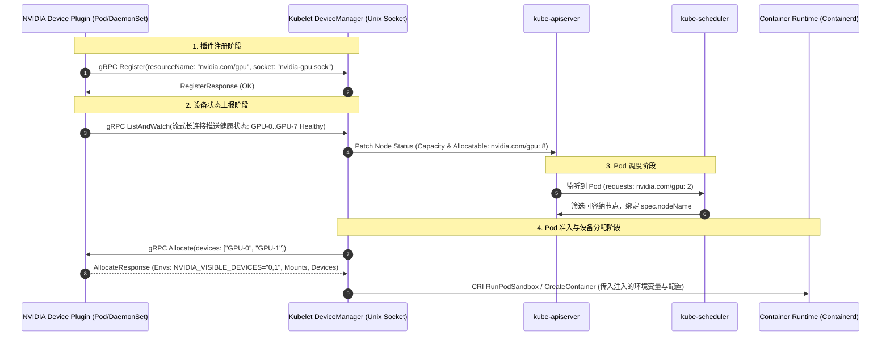

# 模块 5：Kubernetes Device Plugin 机制深析

> **本章重点**：Kubelet `DeviceManager` 控制循环、gRPC 协议生命周期（`Register` / `ListAndWatch` / `Allocate`）、`NVIDIA_VISIBLE_DEVICES` 环境变量注入与标量分配的天然架构缺陷。

---

## 1. Device Plugin 架构与交互时序



---

## 2. 核心机制剖析

### 2.1 Kubelet DeviceManager 核心状态机
Kubelet 的 DeviceManager 维护着节点加速设备的权威状态表：
- **`healthyDevices` & `unhealthyDevices`**：通过插件的 `ListAndWatch` 持续更新。
- **`allocatedDevices`**：记录当前哪些 Pod 占用了具体哪个物理 GPU ID。
- **检查点机制 (`/var/lib/kubelet/device-plugins/kubelet_internal_checkpoint`)**：Kubelet 重启时，依赖本地检查点恢复分配状态，确保在未收到 APIServer 新状态前不发生设备分配冲突。

### 2.2 gRPC 契约与分配过程
1. **`Register`**：插件监听 `/var/lib/kubelet/device-plugins/nvidia-gpu.sock`，向 Kubelet 的主套接字发起注册，声明资源名称（如 `nvidia.com/gpu`）。
2. **`ListAndWatch`**：双向流 RPC，只要有硬件发生 ECC 错误或掉卡，插件立即推流，Kubelet 更新 Allocatable 资源。
3. **`Allocate`**：当 Pod 在该节点启动时，Kubelet 选出 2 个空闲 Device ID，通过 `Allocate` 调用插件。插件返回：
   - 环境变量：如 `NVIDIA_VISIBLE_DEVICES=GPU-3b8a...`
   - 设备挂载：宿主机字符设备映射到容器内
   - 挂载卷：驱动运行时依赖库

### 2.3 Device Plugin 的天然设计缺陷与瓶颈
- **纯标量整数抽象 (Scalar Integer Only)**：在 Pod Spec 中只能写 `nvidia.com/gpu: 1`。无法表达「需要 40GB 显存」、「需要 FP8 算力」、「需要 Ada Lovelace 架构」等属性。
- **拓扑感知盲区 (Topology Blindness)**：Kube-Scheduler 仅知道节点剩余卡数，不知道卡与卡之间的 NVLink 互联关系或 NUMA 亲和性。两个 Pod 分别申请 2 张卡，调度器可能把跨 NUMA 的卡分给一个 Pod，导致 All-Reduce 性能暴跌。
- **无法动态切分 (Static Slicing)**：设备必须在启动阶段固定，无法在运行时根据负载动态重配 MIG 切片。

---

## 3. K8s 资深工程师视角的心智模型映射

| K8s 原生机制 | Device Plugin 机制 | 机制差异与局限 |
| :--- | :--- | :--- |
| **CSI StoragePlugin** | **Device Plugin** | CSI 支持 VolumeAttributes、StorageClass、动态扩容；Device Plugin 只有整数数量，无属性配置。 |
| **CNI NetworkPlugin** | **Device Plugin** | CNI 可以给 Pod 分配 IP、路由、带宽 QoS；Device Plugin 无法做硬件 QoS 限制。 |
| **Scheduler Predicates (Filter)** | **整数计数比较** | 只要 `allocatable - allocated >= requested` 即满足，完全缺乏细粒度硬件特征匹配。 |

---

## 4. 动手实操与排查命令

```bash
# 查看节点汇报的 GPU 资源状态与已分配数量
kubectl describe node <gpu-node-name> | grep -E "nvidia.com/gpu" -A 5

# 查看 Kubelet 的 Device Plugin 注册套接字目录
ls -la /var/lib/kubelet/device-plugins/

# 检查 Kubelet 本地持久化的设备分配检查点 JSON
sudo cat /var/lib/kubelet/device-plugins/kubelet_internal_checkpoint
```

---

## 5. 核心思考题
1. 为什么当使用 `nvidia.com/gpu: 1` 时，Kubernetes 要求 `requests` 必须等于 `limits`，不支持超卖（Overcommit）？
2. 如果某个 Pod 被强制杀死（`kill -9`），Kubelet 已经释放了设备记录，但 GPU 内部的 CUDA Context 尚未彻底回收，会导致什么现象？
