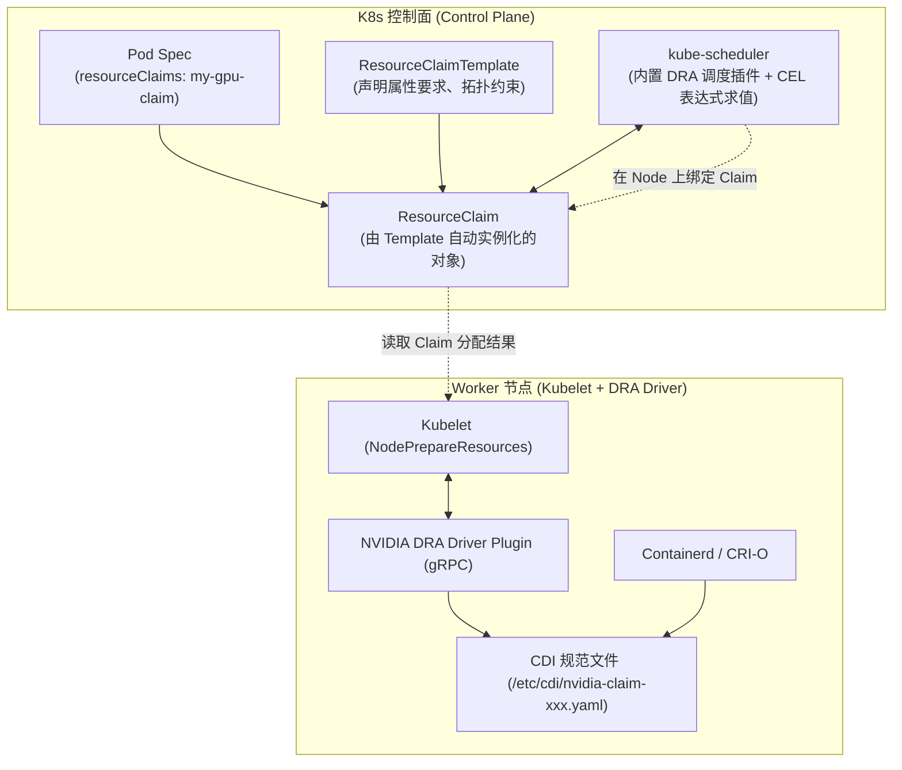

# 模块 6：下一代动态资源分配 (DRA)

> **本章重点**：KEP-3063 架构、`ResourceClaim` / `ResourceClass` 抽象、结构化参数（Structured Parameters）、调度器 CEL 拓扑匹配、DRA Driver 与 CDI 深度融合。

---

## 1. DRA 架构：告别标量设备模型



---

## 2. 核心机制剖析

### 2.1 为什么需要 DRA（Dynamic Resource Allocation）？
传统的 Device Plugin 无法应对现代 AI/ML 基础设施的复杂需求：
- 用户不仅需要「1 张卡」，还需要「显存 $\ge 80\text{GB}$」、「架构为 Hopper/Blackwell」、「两张卡之间必须具备 NVLink 直连」、「要求切分为特定的 MIG 规格」。
- **DRA 将加速资源提升为与持久化存储（PVC/PV）对等的一等公民抽象**。

### 2.2 核心 API 对象模型
- **`ResourceClass`**：类似于 `StorageClass`，定义资源池的类型和驱动名称（如 `gpu.nvidia.com`）。
- **`ResourceClaimTemplate`**：内嵌在 Pod 模板或工作负载控制器（如 Deployment / Job）中，声明对资源的参数诉求。
- **`ResourceClaim`**：记录具体的资源分配结果、绑定的 Node、保留的设备属性。

### 2.3 结构化参数 (Structured Parameters) 与 CEL 匹配
在 DRA 早期版本中，调度器无法理解设备的具体参数，必须调用外部 DRA Controller，导致调度吞吐极低。
- **Kubernetes 1.30/1.31+ 引入 Structured Parameters**：
  - 硬件驱动以标准化结构（Device Attributes）上报设备属性（如显存、架构、NVLink 拓扑矩阵）。
  - 用户在 Claim 中使用 **CEL (Common Expression Language)** 编写筛选表达式，例如：
    ```cel
    device.attributes["gpu.nvidia.com"].memory >= 80 * 1024 * 1024 * 1024 &&
    device.attributes["gpu.nvidia.com"].architecture == "hopper"
    ```
  - **调度器无需与外部驱动通信**，直接在内存快照中完成毫秒级的高并发过滤与拓扑打分！

---

## 3. K8s 资深工程师视角的心智模型映射

| 原生存储模型 (CSI) | 现代动态资源分配模型 (DRA) | 设计哲学对齐 |
| :--- | :--- | :--- |
| **`StorageClass`** | **`ResourceClass`** | 资源提供者与分类定义。 |
| **`PersistentVolumeClaim` (PVC)** | **`ResourceClaim`** | 声明式资源使用申请。 |
| **CSI Provisioner / Attacher** | **DRA Central Controller / Scheduler Plugin** | 控制面完成资源撮合与绑定。 |
| **CSI NodeStage / NodePublish** | **NodePrepareResources (Node Plugin)** | 节点侧完成设备挂载与 CDI 规范生成。 |

---

## 4. 动手实操与排查命令

```bash
# 查看集群中的 ResourceClasses
kubectl get resourceclasses.resource.k8s.io

# 查看当前活跃的 ResourceClaims 与其分配状态
kubectl get resourceclaims.resource.k8s.io -A -o wide

# 查看 Claim 的具体分配结果与绑定的设备 UUID
kubectl describe resourceclaim <claim-name>
```

---

## 5. 核心思考题
1. 为什么说 DRA 是解决大规模分布式训练中「GPU 拓扑感知调度」（如多机多卡 RDMA + NVLink）的终极架构路径？
2. 在从 Device Plugin 向 DRA 演进的过程中，集群管理员需要对现有作业的 YAML 文件做哪些改造？
