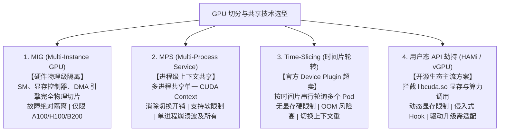

# 模块 7：GPU 虚拟化与切分共享技术

> **本章重点**：为什么 GPU 共享远比 CPU 困难、MIG 硬件物理隔离、MPS 进程级并发与上下文共享、Time-slicing 时间片轮转超卖、HAMi/Volcano 等第三方劫持切分方案。

---

## 1. 四大 GPU 切分共享技术横向对比



---

## 2. 核心机制剖析

### 2.1 为什么在 Linux/K8s 中共享 GPU 如此棘手？
- **CPU 的隔离机制**：依赖 Linux 内核的 CFS（完全公平调度器）、MMU 虚拟内存页表和 CGroup（`cpu.cfs_quota_us`, `memory.max`）。
- **GPU 的黑盒特性**：GPU 拥有独立的硬件调度引擎和显存控制器。传统的驱动程序无法像 Linux 内核那样对单个容器在微秒级强制施加显存硬限制或 CPU 般的抢占式时间片。一旦显存超标，直接抛出 `CUDA out of memory` 导致容器崩溃。

### 2.2 MIG (Multi-Instance GPU) 深入
- **物理切分原理**：从 Ampere 架构引入，将单张 GPU 物理划分为最多 7 个独立的 GPU 实例（GPU Instances, GI）与计算实例（Compute Instances, CI）。
- **完全硬件级隔离**：每个实例独占专用的 SM 阵列、显存控制器（Memory Controller）、片上横向交叉开关和 DMA 传输引擎。一个实例内部发生段错误或死循环，绝对不影响同卡上的其他实例。
- **K8s 集成策略**：
  - **Single 策略**：全集群或全节点所有 GPU 切分为完全相同规格的实例（如全为 `1g.10gb`）。
  - **Mixed 策略**：节点内混合切分不同规格，需结合 GFD（GPU Feature Discovery）暴露丰富的节点标签。

### 2.3 MPS (Multi-Process Service) 机制与权衡
- **原理**：启动一个宿主机守护进程（`nvidia-cuda-mps-control`），所有容器应用作为 MPS Client 连接至守护进程，共享同一个底层的 CUDA Context。
- **优势**：消除了多个进程在 GPU 之间切换 Context 的时钟周期惩罚（减少数百毫秒），小批次模型推理吞吐可提升 2~5 倍。支持通过环境变量配置显存上限（`CUDA_MPS_PINNED_DEVICE_MEM_LIMIT`）和线程利用率（`CUDA_MPS_ACTIVE_THREAD_PERCENTAGE`）。
- **致命弱点**：缺乏硬件容错隔离。任何一个 Client 触发致命内存访问错误（如 XID 31），会导致整个 MPS Server 崩溃，连带杀死共享该卡的所有其他 Pod。

---

## 3. K8s 资深工程师视角的心智模型映射

| K8s / 容器隔离层级 | GPU 共享技术对应 | 隔离与安全等级 |
| :--- | :--- | :--- |
| **Kata Containers / 硬件微虚拟机 (Firecracker)** | **MIG (Multi-Instance GPU)** | 最高：完全硬件隔离，故障域完全隔绝，多租户强安全。 |
| **Linux CFS Quota + cgroup v2 共享** | **HAMi / 劫持层动态显存调度** | 中等：依靠内核/用户态库拦截模拟配额，适用于一般信任环境。 |
| **多线程共享同一进程内存空间** | **MPS (Multi-Process Service)** | 低：吞吐极高但共享崩溃故障域，适合单租户高并发微小服务。 |
| **无资源限制纯靠抢占的超卖 Pod** | **Time-Slicing** | 最低：无显存隔离，容易相互踩踏 OOM。 |

---

## 4. 动手实操与排查命令

```bash
# 检查当前卡是否支持并启用了 MIG 模式
nvidia-smi -i 0 --query-gpu=mig.mode.current --format=csv

# 启用 MIG 模式（需要 root 权限，会重置所有正在运行的 Context）
sudo nvidia-smi -i 0 -mig 1

# 列出当前卡可创建的 MIG Profile 模板
nvidia-smi mig -lgip

# 创建一个 1g.10gb 规格的 MIG 实例
# sudo nvidia-smi mig -cgi 19 -C
```

---

## 5. 核心思考题
1. 为什么目前大语言模型（LLM）分布式推理通常禁止使用 MPS 或 MIG，而必须独占完整物理 GPU？
2. 在公有云环境中，如果你负责规划一个承载数百个小型业务模型的 AI 推理集群，你会采用哪种切分方案以平衡资源利用率与稳定性？
