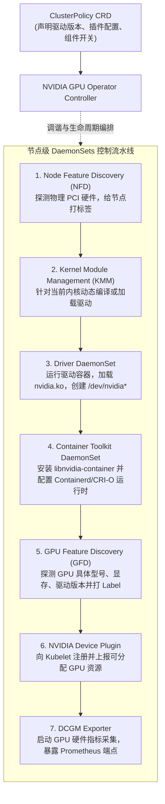

# 模块 8：NVIDIA GPU Operator 与集群生命周期管理

> **本章重点**：GPU Operator 控制面架构、DaemonSets 依赖链条、驱动容器化注入机制、KMM 内核模块管理、生产环境驱动平滑升级与节点排水排错。

---

## 1. GPU Operator 核心架构与 DaemonSet 链条



---

## 2. 核心机制剖析

### 2.1 驱动容器化是如何实现的？
在传统运维中，显卡驱动直接安装在宿主机 Linux 操作系统中。而在云原生架构下，**驱动被封装进容器内**运行：
- 驱动容器以 `privileged: true` 权限运行，挂载宿主机的 `/lib/modules`、`/dev`、`/usr` 等目录。
- 启动脚本检查当前宿主机 Linux 内核版本（`uname -r`），从预编译镜像包或现场通过 DKMS 动态编译生成 `nvidia.ko`。
- 执行 `insmod` / `modprobe` 将驱动加载进宿主机内核空间，并在宿主机 `/dev` 创建设备节点。

### 2.2 驱动平滑升级与节点维护策略
升级生产环境中的 GPU 驱动是最危险的运维操作之一：
1. **驱逐现有工作负载**：`kubectl drain <node> --ignore-daemonsets --delete-emptydir-data`。必须确保没有存量 Pod 正在调用 `/dev/nvidia*`。
2. **内核模块卸载难题**：如果任何系统守护进程（如残留的 DCGM Exporter、Zabbix Agent）未完全释放驱动句柄，`rmmod nvidia` 将返回 `Device or resource busy`，导致驱动升级卡死甚至内核崩溃（Kernel Panic）。
3. **Operator 的自动滚动更新限制**：生产环境中强烈建议将 `ClusterPolicy` 的 `driver.upgradePolicy.autoUpgrade` 设为 `false`，采取按节点池分批次手动金丝雀验证升级。

---

## 3. K8s 资深工程师视角的心智模型映射

| K8s 运维场景 | GPU Operator 对应机制 | 关键风险点 |
| :--- | :--- | :--- |
| **Kubelet 与 CRI 升级** | **Driver 与 Toolkit 升级** | 涉及内核级模块动态替换，无法完全做到容器级的零停机热切换。 |
| **Node Auto-repair (自愈)** | **KMM + Driver 重启循环** | 需严格配置 CrashLoopBackOff 告警，防止节点频繁重启内核模块导致硬件掉卡。 |
| **Pod 亲和性与调度标签** | **GFD (GPU Feature Discovery)** | 暴露例如 `nvidia.com/gpu.family: hopper` 等核心标签供调度器匹配。 |

---

## 4. 动手实操与排查命令

```bash
# 查看 GPU Operator 部署的核心组件状态
kubectl get pods -n gpu-operator -o wide

# 查看 ClusterPolicy CRD 配置
kubectl get clusterpolicy cluster-policy -o yaml

# 查看 GFD 为 GPU 节点自动注入的硬件标签
kubectl get node <gpu-node> --show-labels | tr ',' '\n' | grep "nvidia.com"

# 排查驱动容器加载失败日志
kubectl logs -n gpu-operator -l app=nvidia-driver-daemonset --tail=100
```

---

## 5. 核心思考题
1. 为什么 NVIDIA 开源了 Linux GPU 内核模块（Open GPU Kernel Modules）？它与旧版闭源驱动在 K8s 节点运维上有何优势？
2. 如果 Kubernetes 节点触发操作系统自动内核补丁更新（如 `apt-get upgrade linux-image`），而驱动容器未包含对应内核的模块，会导致什么后果？应如何设计预防方案？
