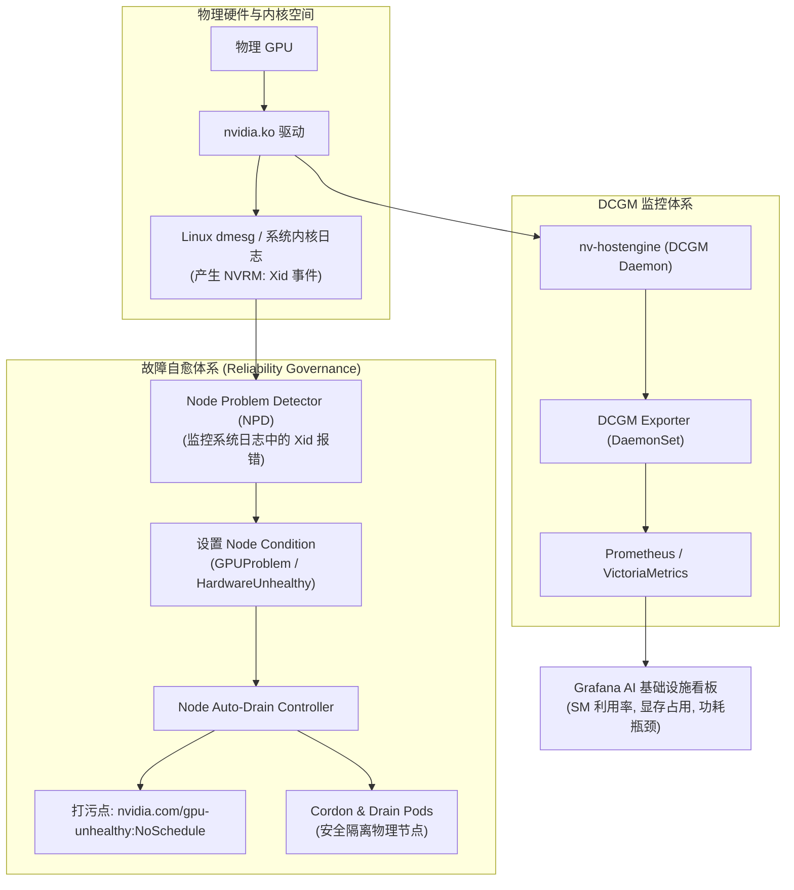

# 模块 9：GPU 集群可观测性与硬件可靠性治理

> **本章重点**：DCGM 架构与 DCGM-Exporter 核心监控指标、典型硬件 XID 故障特征分类、Node Problem Detector (NPD) 规则集成与亚健康节点的自动污点（Taint）与驱逐。

---

## 1. GPU 集群可观测与自愈控制流



---

## 2. 核心机制剖析

### 2.1 DCGM 架构与核心 Prometheus 指标
DCGM（Data Center GPU Manager）是 NVIDIA 官方提供的低开销底层硬件监控代理：
- **`DCGM_FI_DEV_GPU_UTIL`**：SM 运算单元活跃百分比（粗粒度）。
- **`DCGM_FI_DEV_MEM_COPY_UTIL`**：显存读写控制器的饱和度。若该指标接近 100% 而 GPU_UTIL 很低，表明业务陷入 Memory-Bound 严重瓶颈。
- **`DCGM_FI_DEV_NVLINK_BANDWIDTH_TOTAL`**：NVLink 端口聚合吞吐，监控多卡并行分布式训练/推理通信瓶颈。
- **`DCGM_FI_DEV_POWER_VIOLATION` & `DCGM_FI_DEV_THERMAL_VIOLATION`**：供电不足或散热降频告警。

### 2.2 生产级致命故障：XID 错误深度解密
当 GPU 硬件或驱动检测到异常时，会在系统内核日志中打印 `NVRM: Xid (PCI:0000:XX:XX): <Code>, ...`：
- **XID 31 (MMU Page Fault)**：非法显存访问（类似 Linux 段错误 SIGSEGV）。通常是应用程序指针越界或显存踩踏，硬件未坏。
- **XID 43 (GPU has fallen off the bus / stopped processing)**：GPU 停止响应，通常因供电过载、PCIe 物理总线掉速或硬件静电击穿引起。
- **XID 62 (Internal micro-controller warning)**：微控制器固件通信超时，往往预示着物理芯片即将永久损坏。
- **XID 79 (GPU has fallen off the bus)**：物理层彻底掉线，系统执行 `lspci` 甚至无法探测到该设备，必须物理冷重启或售后换件。

### 2.3 基于 NPD 的自愈闭环设计
传统的 Kubelet 节点存活检查仅关注内存、磁盘和 CPU。GPU 发生 XID 79 掉卡后，Node 状态仍然是 `Ready`，导致新 Pod 继续调度上节点并立即失败。
- **治理方案**：配置 NPD 的 `custom-plugin-monitor`，实时 tail 宿主机 `/dev/kmsg`。
- 一旦匹配到 `Xid 79`、`Xid 62` 等严重硬件故障，自动为 Node 打上污点 `nvidia.com/gpu-broken:NoSchedule`，同时联动排水控制器通知告警系统。

---

## 3. K8s 资深工程师视角的心智模型映射

| K8s 经典治理机制 | GPU 可观测与治理机制 | 治理逻辑对齐 |
| :--- | :--- | :--- |
| **Node DiskPressure / MemoryPressure** | **XID 故障导致 NodeCondition 异常** | 硬件亚健康信号驱动控制面进行调度隔离。 |
| **cAdvisor 容器资源指标** | **DCGM Exporter GPU 指标** | 容器/Pod 级别的细粒度算力利用率归属分析。 |
| **Kubelet Node Taint & Toleration** | **硬件故障自动 Taint** | 隔离有损节点，防止新作业被黑洞吞噬。 |

---

## 4. 动手实操与排查命令

```bash
# 实时抓取内核中的 XID 报错日志
sudo dmesg -T | grep -i "nvrm: xid"

# 查看 DCGM 诊断状态
dcgmi diag -r 1

# 使用 dcgmi 检查指定 GPU 的健康与错误计数
dcgmi health -c -g 0

# 模拟 NPD 规则检测输出
kubectl describe node <gpu-node> | grep -A 10 "Conditions:"
```

---

## 5. 核心思考题
1. 为什么单纯依据 `nvidia-smi` 看到的 `GPU-Util` 指标无法准确衡量 GPU 是否真正被充分利用？为什么需要结合 `Tensor Core Active` 与 `DRAM Active` 综合判断？
2. 当集群中某个节点偶发 XID 31 时，应该驱逐该 Pod 还是下线整个物理节点？如何区分软件 Bug 与硬件缺陷？
