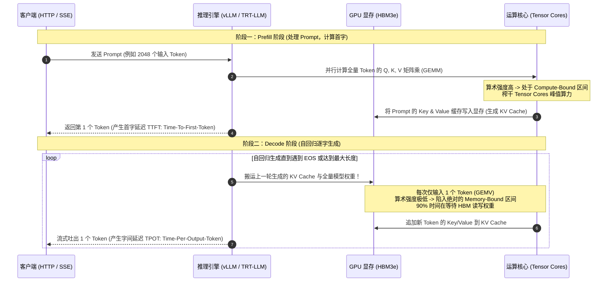

# 模块 10：大模型推理的计算与显存模型

> **本章重点**：Transformer Decoder 推理全周期、Prefill（首字）与 Decode（逐字）阶段的计算特征剧变、显存占用四要素深入量化、TTFT 与 TPOT 核心性能指标。

---

## 1. 推理双阶段：算力受限与显存带宽受限的剧烈转换



---

## 2. 核心机制剖析

### 2.1 Prefill 阶段 vs Decode 阶段计算特征对比

| 评估维度 | Prefill 阶段 (Prompt Phase) | Decode 阶段 (Generation Phase) |
| :--- | :--- | :--- |
| **计算类型** | 大矩阵乘（GEMM: General Matrix Multiply） | 矩阵乘向量（GEMV: Matrix-Vector Multiply） |
| **并发粒度** | 全量 Prompt Token 同时并行输入 | 单个 Token 串行依赖上一个 Token |
| **性能瓶颈** | **Compute-Bound (算力受限)** | **Memory-Bound (显存带宽受限)** |
| **硬件主导单元** | Tensor Cores (浮点计算能力) | HBM 显存控制器与内存总线带宽 |
| **对应业务指标** | **TTFT (Time To First Token)** 首字时间 | **TPOT (Time Per Output Token)** / 吞吐速率 |

### 2.2 显存占用四大金刚（数学精确量化）
一台 GPU 上的显存容量（如 H100 80GB）被严格分配为以下四部分：
1. **静态模型权重（Model Weights）**：
   $$\text{显存占用} \approx \text{参数量 } N \times \text{精度字节数}$$
   - 例如 LLaMA-3-70B 模型：
     - FP16 (2 字节): 约 $70 \times 2 = 140\text{ GB}$（单卡 80GB 放不下，必须双卡 TP=2 或量化）。
     - FP8 (1 字节): 约 $70 \times 1 = 70\text{ GB}$。
     - INT4 (0.5 字节): 约 $35\text{ GB}$。
2. **KV Cache（动态显存大户）**：
   自回归模型为了避免重复计算历史 Token 的 Key/Value，必须将其缓存在显存中。单层 Transformer 的 KV 大小：
   $$\text{KV Cache 大小} = 2 \times 2 \times n_{\text{layers}} \times n_{\text{heads}} \times d_{\text{head}} \times \text{Tokens} \times \text{Bytes}$$
   随着并发请求数和上下文长度线性暴增，KV Cache 往往会吃光剩余的所有显存，引发动态 OOM。
3. **激活值（Activation Memory）**：
   在模型前向传播过程中产生的临时中间张量（通过算子融合 Operator Fusion 可大幅削减）。
4. **推理引擎工作区（Workspace / Scratchpad）**：
   cuBLAS / cuDNN 矩阵计算申请的临时临时缓冲区。

---

## 3. K8s 资深工程师视角的心智模型映射

| 传统 Web 微服务模式 | 大模型推理工作流 | 架构异同点 |
| :--- | :--- | :--- |
| **无状态计算服务 (Stateless HTTP Handler)** | **Prefill 阶段** | 请求进来，消耗瞬时高算力，快速返回结果，无内部长期状态保留。 |
| **长连接有状态网关 (Stateful WebSocket / SSE)** | **Decode 阶段** | 长期占用本地显存（KV Cache），直到连接断开才释放状态。 |
| **进程 JVM 堆内存与内存泄漏** | **KV Cache 显存膨胀与碎片** | 请求激增时，若没有严格的流控或分页管理，必将触发显存 Out-Of-Memory 崩溃。 |

---

## 4. 动手实操与排查命令

```bash
# 使用 Python 快速测算 LLaMA 70B 的 KV Cache 显存占用
python3 -c '
layers = 80; heads = 64; head_dim = 128; seq_len = 4096; batch = 16
bytes_per_token = 2 * 2 * layers * (heads * head_dim) * 2 # 2(K+V) * layers * hidden * 2(fp16)
total_gb = bytes_per_token * seq_len * batch / (1024**3)
print(f"Total KV Cache for Batch {batch} & SeqLen {seq_len}: {total_gb:.2f} GB")
'

# 监控推理引擎服务启动后的静态与动态显存分配
nvidia-smi --query-compute-apps=pid,process_name,used_memory --format=csv
```

---

## 5. 核心思考题
1. 为什么在并发数（Concurrency）提升时，Decode 阶段的吞吐利用率（Tokens/s）会随之增加，逐渐从 Memory-bound 向 Compute-bound 靠拢？
2. 什么是投机采样（Speculative Decoding）？它如何利用一个小模型（Draft Model）来打破大模型在 Decode 阶段的显存带宽瓶颈？
