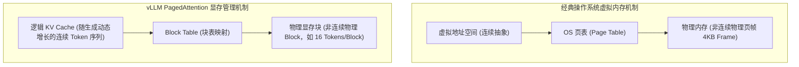
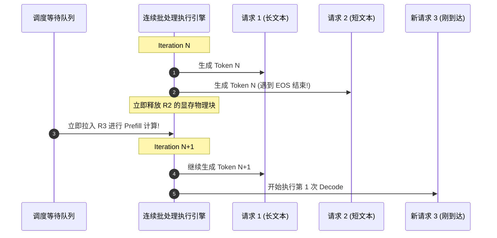

# 模块 11：现代推理引擎核心技术

> **本章重点**：PagedAttention 内存分页机制、连续批处理（Continuous Batching）、Chunked Prefill 技术、主流引擎（vLLM / TensorRT-LLM / Triton）架构对比。

---

## 1. 架构总览：从操作系统分页到 PagedAttention



---

## 2. 核心机制剖析

### 2.1 传统 KV Cache 分配的痛点：碎片化与浪费
在 vLLM 出现之前，主流引擎必须为每个请求预先分配一个固定上限的显存连续空间（如预留支持 4096 长度的显存）：
- **内部碎片 (Internal Fragmentation)**：若请求实际只生成了 100 个 Token，剩下的 3996 个 Token 的显存空间全部被空置占用。
- **外部碎片 (External Fragmentation)**：由于不同请求长度不同，动态 `cudaMalloc` / `cudaFree` 导致显存形成大量不连续碎片，最终引发虚假 OOM。
- **显存浪费率高达 60%~80%**，严重压制了并发批次（Batch Size）。

### 2.2 PagedAttention 原理与优势
- **块状切分 (Block Slicing)**：将逻辑上的 KV Cache 切分为固定大小的物理块（如每个 Block 存储 16 个 Token 的 KV 向量）。
- **非连续物理分配**：物理块分散在 HBM 显存的任意位置，通过每个请求持有的 `Block Table` 进行动态映射寻址。
- **零外部碎片，近乎零内部碎片**：仅在请求最后一个 Block 内存在少量未使用的槽位，显存利用率提升至 96% 以上。
- **Prefix Caching & Copy-on-Write (写时复制)**：如果多个请求拥有相同的 System Prompt，物理显存中只需保留一份只读的 KV Block，多个 Block Table 直接指向该物理块。当某个请求开始独立生成新 Token 时，才触发 Copy-on-Write 分配新块。

### 2.3 连续批处理 (Continuous Batching / Iteration-level Scheduling)
- **传统静态批处理**：一组请求必须等待最长的那一个生成完毕后，才能一起退出并接入下一批，短请求在完成后的很长时间都在空转等待。
- **连续批处理**：在**每个 Token 的生成迭代（Iteration）级别**进行调度。只要某个请求生成了 `[EOS]`，引擎立即将其显存释放并从等待队列中拉入一个新请求的 Prefill；长请求则继续参与下一轮 Decode。



---

## 3. K8s 资深工程师视角的心智模型映射

| Linux / 云原生机制 | 推理引擎对应机制 | 机制演进相似度 |
| :--- | :--- | :--- |
| **Linux 页表与 MMU** | **vLLM PagedAttention Block Table** | 彻底消灭连续物理内存分配要求，实现按需页式扩展。 |
| **Linux `fork()` 的 COW 机制** | **Prompt Prefix Caching 共享** | 只读共享父进程/公共前缀内存，写入时按页复制。 |
| **调度器时间片抢占并发** | **Iteration-level Continuous Batching** | 摆脱粗粒度批处理阻塞，以极细粒度时间片最大化利用硬件吞吐。 |

---

## 4. 动手实操与排查命令

```bash
# 启动一个本地 vLLM 服务，观察 PagedAttention 参数配置
python3 -m vllm.entrypoints.openai.api_server \
    --model meta-llama/Llama-2-7b-chat-hf \
    --block-size 16 \
    --gpu-memory-utilization 0.90 \
    --max-num-seqs 256

# 观察 vLLM 启动日志中关于 KV Cache 物理块分配的总量
# INFO: # GPU blocks: 14285, # CPU blocks: 2048
# 说明 14285 * 16 = 228,560 个 Token 的全局并发容量
```

---

## 5. 核心思考题
1. 什么是 Chunked Prefill？为什么说它能有效解决高并发生产场景下 TTFT 与 TPOT 互相打架的难题？
2. 在 Triton Inference Server、TensorRT-LLM 与 vLLM 三者之间，针对低延迟在线高并发场景与异构模型混部场景，各自的架构优势与选型考量是什么？
