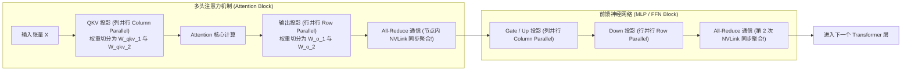

# 模块 12：分布式推理与并行切分策略

> **本章重点**：张量并行（Tensor Parallelism, TP）拆解、列并行与行并行、每层 2 次 All-Reduce 通信强依赖、流水线并行（PP）气泡开销、专家并行（EP）与 MoE 架构（如 DeepSeek）的 All-to-All 通信特征。

---

## 1. 架构总览：张量并行 (TP) 在 Transformer 层内的切分与同步



---

## 2. 核心机制剖析

### 2.1 为什么必须跨卡分布式推理？
1. **显存容量放不下模型权重**：例如 70B 模型 FP16 需要 140GB，单张 80GB 卡无法加载，必须切分到多卡。
2. **需要更大的并发与上下文**：即使小模型能塞下单卡，但高并发长文本下的 KV Cache 也会迅速撑爆单卡，需要通过跨卡切分扩大全局 KV Cache 池。

### 2.2 张量并行 (Tensor Parallelism, TP) 机制深解
- **列并行（Column Parallel）**：将权重矩阵 $W$ 按列切开：$W = [W_1, W_2]$。
  输入 $X$ 广播到每张 GPU，独立计算 $Y_1 = X W_1, Y_2 = X W_2$。此时无需跨卡通信！
- **行并行（Row Parallel）**：将权重矩阵 $W$ 按行切开：$W = \begin{bmatrix} W_1 \\ W_2 \end{bmatrix}$。
  每张 GPU 输入各自的部分，计算得到中间结果，最终必须通过 **All-Reduce（规约求和）** 汇总：$Y = Y_1 + Y_2$。
- **通信死穴**：单层 Transformer 结构中，Attention 块需要 1 次 All-Reduce，FFN 块需要 1 次 All-Reduce。
  以一个 80 层的现代大模型为例，**生成 1 个 Token 就必须在多卡之间同步触发 $80 \times 2 = 160$ 次 All-Reduce！**
- **结论**：这就是为什么 **TP 必须且只能运行在单机内的 NVLink 高速网络（900 GB/s）上**。一旦走跨节点的以太网或未开启 RDMA，通信延迟将让整个推理服务彻底陷入停滞。

### 2.3 流水线并行 (Pipeline Parallelism, PP)
- 将模型的不同网络层（如 1~40 层与 41~80 层）切分到不同的节点/卡上。
- 跨阶段之间只传递中间激活值（Activation），通信数据量比 TP 小得多，适合跨节点横向扩展。
- **核心缺点**：流水线气泡（Bubble）。后半截节点必须等待前半截节点计算完成，导致硬件利用率存在固有损失。

### 2.4 专家并行 (Expert Parallelism, EP) 与 MoE (Mixtral / DeepSeek)
- 在混合专家模型（MoE）中，每个 Token 由路由网络（Router）分发给特定的少量专家（如 64 个专家中激活 8 个）。
- 不同专家部署在不同 GPU 上，此时需要执行 **All-to-All** 通信（每个 GPU 都要把属于其他 GPU 专家的 Token 发送过去，并接收发回给自己的 Token）。
- **挑战**：MoE 对网络全互联的横向二分带宽（Bisection Bandwidth）提出了极高要求。

---

## 3. K8s 资深工程师视角的心智模型映射

| 分布式系统拓扑 | GPU 并行切分技术 | 通信与延迟敏感度 |
| :--- | :--- | :--- |
| **共享内存 / 多核 CPU 锁同步** | **张量并行 (TP)** | 极度敏感（微秒级），必须同机 NVLink，严禁跨网络。 |
| **微服务同步 RPC 流水线调用** | **流水线并行 (PP)** | 毫秒级敏感，允许跨节点通过高性能网络串联。 |
| **MapReduce / Shuffle 阶段** | **MoE 专家并行 (EP) All-to-All** | 对集群交换机突发带宽和全网吞吐要求极高，极易发生网络拥塞（Incast）。 |

---

## 4. 动手实操与排查命令

```bash
# 使用 NCCL 测试套件测试单机 8 卡 All-Reduce 通信带宽
# 验证是否真正跑满了 NVLink 双向带宽（单向约 400+ GB/s）
/usr/local/cuda/bin/all_reduce_perf -b 8M -e 1G -f 2 -g 8

# 启动 vLLM 并指定张量并行度 TP=4
python3 -m vllm.entrypoints.openai.api_server \
    --model /models/llama-3-70b \
    --tensor-parallel-size 4 \
    --pipeline-parallel-size 1
```

---

## 5. 核心思考题
1. 为什么当单机 8 卡配置 TP=8 时，如果其中 1 张卡发生故障（掉卡或死锁），整个 8 卡实例必须全部重启，无法单卡降级？
2. 在跨节点的超大规模推理集群中，TP 与 PP 通常如何混合使用（例如 TP=8 + PP=2）？K8s 调度器应当如何感知这种分层通信亲和性？
