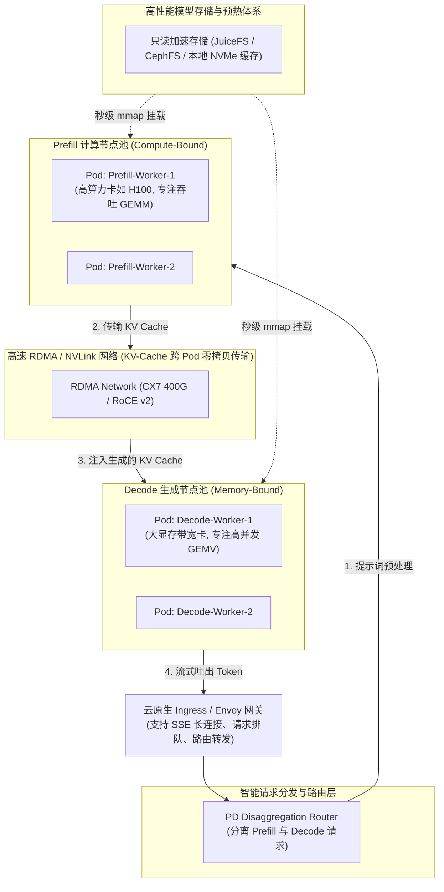

# 模块 13：生产级 AI 推理架构与编排落地

> **本章重点**：大模型权重秒级加载（SafeTensors 与 `mmap`）、KEDA 基于业务指标（TTFT/TPOT/KV Cache）的弹性伸缩、Prefill-Decode 存算分离（PD Disaggregation）架构与流式不断流平滑迁移。

---

## 1. 架构总览：生产级云原生大模型推理平台全貌



---

## 2. 核心机制剖析

### 2.1 传统模型加载痛点 vs SafeTensors `mmap` 零拷贝
- **痛点**：传统 PyTorch `.bin` 格式在 Pod 启动时需要从对象存储（S3/GCS）拉取数十 GB 数据，然后由 Python 进程在 Host 内存中逐层解析、反序列化，再调用 `cudaMemcpy` 拷贝至 GPU 显存。一个 70B 模型启动往往耗时 15~30 分钟，弹性伸缩彻底失效。
- **现代化解法**：
  - **SafeTensors 格式**：纯二进制连续张量存储，杜绝反序列化安全风险。
  - **Linux `mmap` 零拷贝**：直接利用 Linux 虚拟内存映射将文件指针映射至用户空间，配合 GPU 驱动直接发起 DMA，模型预热时间从数十分钟缩短至 **10~30 秒**！
  - **存储加速**：结合 K8s DaemonSet 在每台物理机挂载本地 NVMe 作为 HostPath 缓存池，或采用分布式缓存文件系统（JuiceFS, Fluid）。

### 2.2 为什么传统 CPU/Memory HPA 在 AI 推理中彻底失效？
在 Kubernetes 中，默认的 HPA 基于 CPU 利用率或内存利用率：
- **致命问题**：
  1. **CPU 利用率常年极低**：推理主进程绝大部分计算在 GPU 运行，CPU 利用率可能仅有 5%~10%。
  2. **显存利用率常年接近 100%**：现代推理引擎（如 vLLM）启动时就会根据 `--gpu-memory-utilization 0.90` **预先占满 90% 的显存**以建立 KV Cache 物理块池。无论当前是有 1 个请求还是 100 个请求，显存占用恒定不变！
- **现代弹性指标架构（基于 KEDA）**：
  - **`vllm:num_requests_waiting`**（等待队列深度）：一旦积压说明算力饱和，立即触发水平扩容。
  - **`vllm:gpu_cache_usage_factor`**（KV Cache 实际物理块使用率）：超过 80% 提前扩容，防止突发大长文本 OOM。
  - **P95 TTFT 与 P95 TPOT**：基于业务 SLA 响应时间驱动伸缩。

### 2.3 存算分离架构：Prefill-Decode Disaggregation (PD 分离)
- **底层驱动力**：Prefill 是 Compute-Bound，需要极高 TFLOPS 的芯片；Decode 是 Memory-Bound，需要极高 HBM 带宽与大容量显存。
- 将两组不同特性的计算强行挤在同一个 Pod 内，会导致严重的相互干扰（如长 Prompt 的 Prefill 瞬间阻塞数十个正在流畅吐字的 Decode 请求，导致 TPOT 出现尖刺卡顿）。
- **PD 分离架构**：独立部署 Prefill Pod 池与 Decode Pod 池。Prefill 节点计算完 Prompt 产生 KV Cache 后，通过高速 RDMA 网络（如 Mooncake, Splitwise 机制）直接远程传输到 Decode 节点的显存中，实现真正的算力异构最优解。

---

## 3. K8s 资深工程师视角的心智模型映射

| 传统大型分布式架构 | 生产级 AI 推理架构 | 架构本质对齐 |
| :--- | :--- | :--- |
| **CQRS（读写分离 / 存算分离）** | **Prefill-Decode 分离架构** | 将计算特征截然不同的两个阶段解耦为独立微服务。 |
| **消息队列积压驱动消费者弹性 (Kafka Lag HPA)** | **KEDA 队列深度与 KV-Cache 饱和度伸缩** | 摒弃无意义的硬件利用率，以待处理工单数量作为伸缩驱动源。 |
| **优雅下线与不断流发布 (Graceful Shutdown)** | **流式 SSE 连接保活与排空 (Drain)** | 等待进行中的生成完毕，拒绝新请求，保护用户正在接收的流式输出。 |

---

## 4. 动手实操与排查命令

```yaml
# 生产级 KEDA ScaledObject 示例：基于 vLLM 等待队列进行弹性伸缩
apiVersion: keda.sh/v1alpha1
kind: ScaledObject
metadata:
  name: vllm-autoscaler
spec:
  scaleTargetRef:
    name: vllm-llama-deployment
  minReplicaCount: 1
  maxReplicaCount: 8
  triggers:
  - type: prometheus
    metadata:
      serverAddress: http://prometheus-k8s.monitoring.svc:9090
      metricName: vllm_num_requests_waiting
      query: sum(vllm:num_requests_waiting{namespace="ai-serving"})
      threshold: '5'
```

---

## 5. 核心思考题
1. 在大模型长连接流式推理（SSE / HTTP Chunked）场景下，当 K8s 触发滚动更新或缩容时，如何确保正在逐字生成的客户端连接不被强制杀死？
2. 为什么在采用跨节点的 Prefill-Decode 分离架构时，RDMA 网络的带宽与网卡吞吐往往成为限制系统端到端性能的关键瓶颈？
