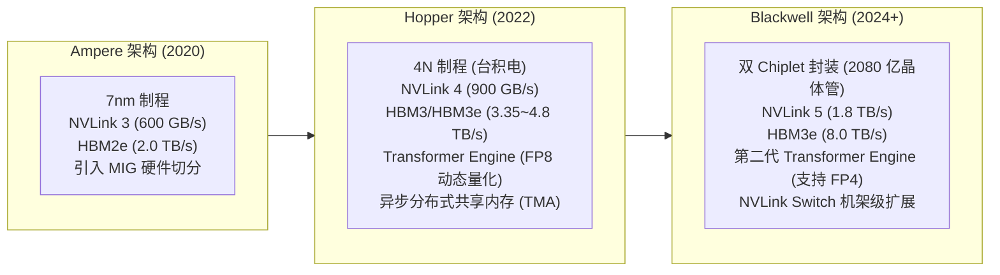

# 附录 A：主流现代 GPU 硬件规格与拓扑速查

> **本附录提供生产环境中主流数据中心 GPU 核心参数对比，涵盖架构代际、计算精度峰值算力、显存类型与带宽、片间互联拓扑等核心指标。**

---

## 1. 主流数据中心 GPU 关键参数矩阵

| 芯片型号 | 架构代际 | 显存规格 (容量 / 类型) | 显存带宽 (TB/s) | FP16/BF16 Tensor (TFLOPS) | FP8 Tensor (TFLOPS) | 片间互联方式 | 典型功耗 (TDP) | 生产主力定位 |
| :--- | :--- | :--- | :--- | :--- | :--- | :--- | :--- | :--- |
| **A100 (SXM4)** | Ampere | 80 GB HBM2e | 2.0 TB/s | 312 | 不支持 | NVLink 3 (600 GB/s) | 400 W | 经典训练与推理主力 |
| **A100 (PCIe)** | Ampere | 80 GB HBM2e | 1.9 TB/s | 312 | 不支持 | PCIe Gen4 (64 GB/s) | 250~300 W | 传统通用服务器推理 |
| **H100 (SXM5)** | Hopper | 80 GB HBM3 | 3.35 TB/s | 989 | 1,979 | NVLink 4 (900 GB/s) | 700 W | 现代主流大模型训练/推理基准 |
| **H100 (PCIe)** | Hopper | 80 GB HBM2e | 2.0 TB/s | 756 | 1,513 | PCIe Gen5 (128 GB/s) | 350 W | 现有非 NVSwitch 节点适配 |
| **H200 (SXM5)** | Hopper | 141 GB HBM3e | 4.8 TB/s | 989 | 1,979 | NVLink 4 (900 GB/s) | 700 W | 超长上下文与高并发推理卡皇 |
| **B200 (SXM)** | Blackwell | 192 GB HBM3e | 8.0 TB/s | 2,250 | 4,500 | NVLink 5 (1.8 TB/s) | 1000 W | 下一代超大规模分布式集群 |
| **L40S** | Ada Lovelace | 48 GB GDDR6 | 0.86 TB/s | 366 | 733 | PCIe Gen4 (无 NVLink) | 350 W | 多模态与小批次高算力单卡推理 |
| **L4** | Ada Lovelace | 24 GB GDDR6 | 0.30 TB/s | 120 | 240 | PCIe Gen4 (无 NVLink) | 72 W | 轻量化推理与边缘云原生节点 |

---

## 2. 核心架构与互联拓扑演进图

---

## 3. 生产选型指南总结
- **超大模型（70B+）分布式在线推理**：首选 **H100/H200 SXM5**（必须具备 8 卡 NVSwitch 满带宽 NVLink，支撑 TP=8 高频 All-Reduce）。
- **长上下文（128K+ 上下文窗口）大显存推理**：首选 **H200 (141GB HBM3e)**，其显存带宽达到惊人的 4.8 TB/s，且单卡显存容量极大，能容纳更多 KV Cache 并发块。
- **高密度小模型与多模态轻量推理**：推荐 **L40S / L4**，单卡独立运行无片间互联通信，功耗比高，性价比优异。
