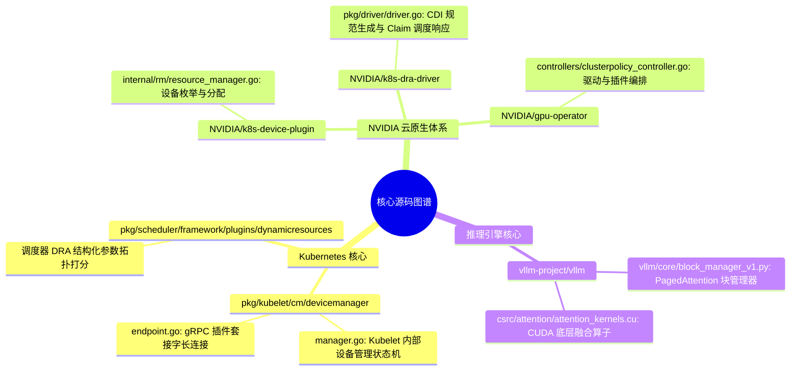

# 附录 C：核心源码与经典必读论文索引

> **本附录整理了深入理解 GPU 物理架构、容器运行时、Kubernetes 调度编排与大模型推理系统的经典原著、KEP 设计提案与核心源码路径。**

---

## 1. 经典学术论文清单 (按学习阶段排列)

### 1.1 硬件架构与计算/访存理论
1. **Roofline 性能模型奠基论文**
   * *Williams, S., Waterman, A., & Patterson, D. (2009).*
   * **"Roofline: An Insightful Visual Performance Model for Multicore Architectures."** *Communications of the ACM, 52(4), 65-76.*
   * **研读重点**：深入理解算术强度（Operational / Arithmetic Intensity）如何决定计算系统的性能天花板。
2. **FlashAttention 核心理论 (IO 感知注意力)**
   * *Dao, T., et al. (2022).*
   * **"FlashAttention: Fast and Memory-Efficient Exact Attention with IO-Awareness."** *NeurIPS 2022.*
   * **研读重点**：重排计算图以最大化利用 SRAM，彻底打破 HBM 访存墙的范式级创新。
   * *配套进阶*：*FlashAttention-2 (2023)* 与 *FlashAttention-3: Fast and Accurate Attention with Asynchrony and FP8 on Hopper (2024)*。

### 1.2 推理引擎与显存分页机制
1. **PagedAttention 与 vLLM**
   * *Kwon, W., et al. (2023).*
   * **"Efficient Memory Management for Large Language Model Serving with PagedAttention."** *SOSP 2023.*
   * **研读重点**：借鉴操作系统虚拟内存页表管理 KV Cache，彻底消除显存内外碎片的系统级设计。
2. **存算分离大模型推理 (PD Disaggregation)**
   * *Qin, Q., et al. (2024).*
   * **"Mooncake: A KVCache-Centric Disaggregated Architecture for LLM Serving."**
   * **研读重点**：基于高速 RDMA 池化 KV Cache，将 Prefill 算力卡与 Decode 显存带宽卡解耦的下一代云原生推理架构。

### 1.3 分布式切分与并行算法
1. **Megatron-LM 张量并行**
   * *Shoeybi, M., et al. (2019).*
   * **"Megatron-LM: Training Multi-Billion Parameter Language Models Using Model Parallelism."**
   * **研读重点**：列并行与行并在多头注意力与前馈网络中的正交切分，以及层内 2 次 All-Reduce 的数学推导。

---

## 2. Kubernetes 官方设计提案 (KEP)

1. **KEP-3063: Dynamic Resource Allocation (DRA)**
   * 仓库路径：`k8s.io/enhancements/keps/sig-node/3063-dynamic-resource-allocation`
   * 必读理由：理解 K8s 从旧时代的标量整数资源（`nvidia.com/gpu: 1`）跨越到声明式复杂硬件资源池的核心驱动力。
2. **KEP-4009: CDI Support in Kubelet**
   * 仓库路径：`k8s.io/enhancements/keps/sig-node/4009-cdi-devices`
   * 必读理由：Container Device Interface 替代传统隐式 Prestart Hook 的标准化演进路径。

---

## 3. 核心开源项目与关键源码树路径

