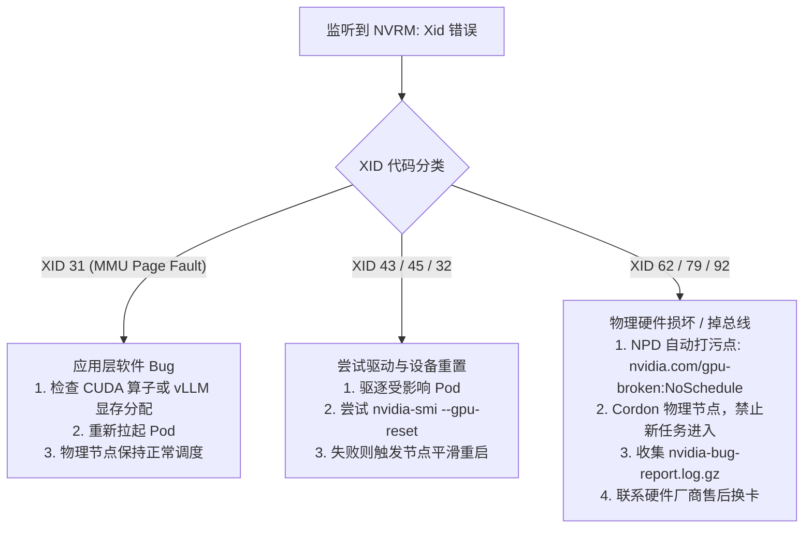

# 附录 B：典型 XID 硬件故障与运维排错手册

> **本附录汇总生产 K8s GPU 集群中最常遭遇的 NVIDIA XID 错误代码、根本诱因、排查流程与处置策略。**

---

## 1. 核心 XID 错误速查矩阵

| XID 代码 | 错误定义 | 严重级别 | 常见根本诱因 | 业务直接表现 | 推荐处置手段 |
| :--- | :--- | :--- | :--- | :--- | :--- |
| **XID 13** | Graphics Engine Exception | 中 | 驱动/着色器指令异常，或显存轻微损坏 | 训练/推理进程突然卡死 | 杀死应用进程并重启容器 |
| **XID 31** | MMU Page Fault | 中 | 非法显存指针访问、野指针越界或显存踩踏 | 报 CUDA Out of Memory 或异常退出 | 排查应用代码与算子内存访问，无需下线硬件 |
| **XID 32** | Corrupted Page Table | 高 | MMU 页表被非法篡改或显存位翻转（Bit-flip） | 节点上该卡所有 Context 崩溃 | 重置该 GPU 甚至冷重启物理机 |
| **XID 43** | GPU stopped processing | 高 | 供电跌落、PCIe 掉速、固件死锁 | GPU 失去响应，驱动挂起 | 尝试 `nvidia-smi --gpu-reset`，失败则重启节点 |
| **XID 45** | Preemptive cleanup | 低/中 | 驱动主动回收死锁或挂起进程占用的显存 | 应用报错退出 | 应用层重试 |
| **XID 62** | Internal Micro-controller Warning | 极高 | GPU 片上微控制器（PMU/GSP）固件通信崩溃 | 硬件即将彻底损坏的前兆 | 立即 Taint 节点并安排售后返厂检测 |
| **XID 79** | GPU fallen off the bus | 灾难级 | 物理层 PCIe 链路断开、严重静电或供电彻底中断 | `nvidia-smi` 报错 `Unable to determine the device handle` | 物理冷断电重启；反复出现需更换主板或 GPU |
| **XID 92** | High-bandwidth memory ECC error | 极高 | HBM 显存发生不可纠正的单粒子多位翻转（DBE） | 正在计算的模型张量发生物理损坏 | 隔离节点，执行显存行替换（Row Remapping）或换卡 |

---

## 2. 生产级排错决策树



---

## 3. Node Problem Detector (NPD) 集成配置示例

在 GPU 节点 DaemonSet 中部署 NPD，并通过正则匹配系统内核中的硬件异常：

```json
{
  "plugin": "kmsg",
  "logPath": "/dev/kmsg",
  "lookback": "5m",
  "bufferSize": 10,
  "source": "kernel-monitor",
  "conditions": [
    {
      "type": "GPUHardwareFailure",
      "reason": "GPUFellOffBus",
      "message": "NVIDIA GPU has fallen off the bus (XID 79) or internal controller error (XID 62)"
    }
  ],
  "rules": [
    {
      "type": "permanent",
      "condition": "GPUHardwareFailure",
      "reason": "Xid79Detected",
      "pattern": "NVRM: Xid \\(PCI:[^)]+\\): 79, pid='.*"
    },
    {
      "type": "permanent",
      "condition": "GPUHardwareFailure",
      "reason": "Xid62Detected",
      "pattern": "NVRM: Xid \\(PCI:[^)]+\\): 62, pid='.*"
    }
  ]
}
```

---

## 4. 应急排错工具箱

```bash
# 生成包含驱动、固件、总线日志的全量诊断报告
sudo nvidia-bug-report.sh

# 查看当前显存行替换（Row Remapping）健康状态（针对 HBM 潜在硬件损坏）
nvidia-smi --query-gpu=remapped_rows.correctable,remapped_rows.uncorrectable,remapped_rows.pending,remapped_rows.failure --format=csv

# 软重置指定的异常 GPU 设备（需先杀死占用该设备的所有进程）
sudo fuser -v /dev/nvidia0
sudo nvidia-smi --gpu-reset -i 0
```
