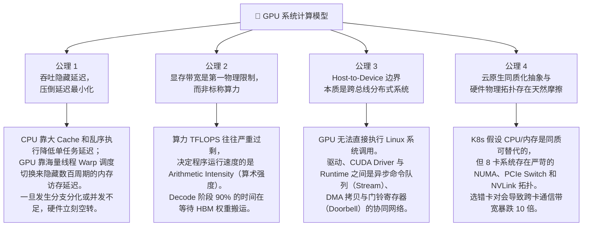
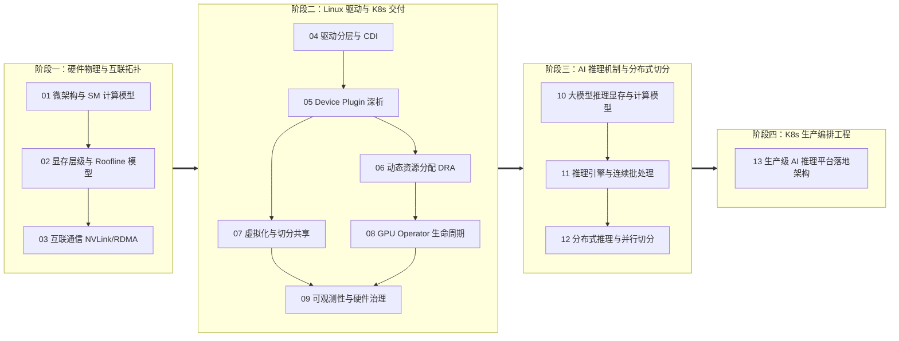

# GPU 核心深潜：导读与全景大纲

> **面向资深云原生与分布式系统工程师的机制级参考手册**

如果你已经深入运维与架构 Kubernetes 多年，你早已熟知 Pod 的生命周期、Kubelet 同步循环、Informers 与 DeltaFIFO 缓存、CGroup 与 Namespace 的隔离边界，以及 CNI/CSI 的控制流。你不需要再看一遍「什么是 GPU」或「显卡驱动怎么装」。

你大概率需要的是这份手册试图提供的两样核心价值：

1. **从分布式系统与操作系统视角，建立对 GPU 内部微架构与硬件边界的物理直觉**：
   为什么在 CPU 上行之有效的并发模型在 GPU 上会导致严重的 Warp Divergence？为什么厂商宣传的数百 TFLOPS 往往是镜花水月，而显存带宽（Bandwidth）才是真正的物理瓶颈？Roofline 模型的数学边界如何决定大模型推理的吞吐极限？
2. **解构从 Linux 内核、容器运行时、K8s 控制面到大模型推理引擎（LLM Engine）的全链路机制**：
   从 `/dev/nvidia*` 字符设备的 ioctl 交互，到 `nvidia-container-toolkit` 的 Hook 注入与 CDI 标准；从 Device Plugin 的标量整数妥协，到 DRA（动态资源分配）的拓扑感知；再到 vLLM/TensorRT-LLM 的 PagedAttention、连续批处理与 Prefill-Decode 存算分离架构。

---

## 第一部分：面向系统工程师的 GPU 四大公理

Kubernetes 的世界建立在「电平触发」、「声明式状态」与「同质化资源池」之上。然而，当你将异构加速硬件引入集群时，原有的心智模型会面临剧烈的物理摩擦。几乎所有 GPU 运维事故、调度倾斜与性能暴跌，都源于以下四条底层公理在起作用。

### 公理 1：吞吐隐藏延迟，压倒延迟最小化

现代 CPU 核心是极致的「低延迟机器」：它拥有巨大的 L1/L2/L3 缓存、复杂的投机执行和深流水线，目标是让单一线程的代码以最快速度跑完。

相反，**GPU 是纯粹的「吞吐量怪物」**：
- 它去掉了复杂的乱序执行引擎，将硅片面积几乎全部让位给运算单元（ALU / Tensor Core）和寄存器堆（Register File）。
- 当一个线程发起全局内存（HBM）访问并面临长达 200~400 个时钟周期的延迟时，GPU 的 Warp Scheduler **并不等待**，而是在单时钟周期内零开销切换到另一个已就绪的 32 线程 Warp 执行。
- **系统推论**：任何打断并发的行为（如线程数量过少无法喂饱 SM、Warp 分支分化、同步屏障）都会直接摧毁 GPU 的延迟隐藏能力，导致硬件利用率呈断崖式下跌。

### 公理 2：显存带宽是第一物理限制，而非标称算力

在评估 GPU 算力时，官方宣传常冠以数百甚至数千 TFLOPS。但对系统工程师而言，**算力通常是最便宜的资源，显存带宽才是昂贵的瓶颈**。

- 衡量算子性能的黄金法则是 **Roofline 模型**：系统的计算吞吐受限于 $\min(\text{峰值算力}, \text{显存带宽} \times \text{算术强度})$。
- 大模型推理的 Decode（生成）阶段，每次生成一个 Token 都需要完整地从 HBM 读取数十 GB 的模型权重，其算术强度（FLOPs per Byte）极低，处于绝对的 **Memory-Bound（内存带宽受限）** 区间。
- **系统推论**：在 AI 推理集群中，片面追求高 TFLOPS 的算力卡可能毫无意义，显存类型（HBM3e vs GDDR6）与内存通道宽度才是决定服务 QPS 与并发容量的胜负手。

### 公理 3：Host-to-Device 边界本质是跨总线分布式系统

在 Linux 进程看来，GPU 并非一段像内存一样可以直接寻址的本地资源，而是一个通过 PCIe / NVLink 总线挂载的远程协处理器。

- CPU 进程与 GPU 的交互通过环形缓冲区（Ring Buffer）和硬件门铃（Doorbell）驱动：CPU 将计算 Kernel 封装为命令发射进 CUDA Stream，GPU 独立异步拉取执行并通过中断或事件通知回传。
- Host 内存到 Device 显存的拷贝必须经过 PCIe 总线，哪怕是 PCIe 5.0 x16 也仅有 64 GB/s 带宽，远低于 HBM3e 的 3~4 TB/s。
- **系统推论**：主机与 GPU 之间频繁的小数据同步、隐式 Host-to-Device 拷贝、CPU 提交速度跟不上 GPU 执行速度（CPU-bound pipeline），是微服务容器化中常见的性能吞吐刺客。

### 公理 4：云原生同质化抽象与硬件物理拓扑存在天然摩擦

Kubernetes 最核心的设计假设是**资源的可量化与同质化**：1 个核的 CPU 就是 1 个核，调度到节点 A 或节点 B 的差异仅体现在剩余容量上。

然而，一台典型的 8 卡 GPU 物理服务器内部是一个高度异质的复杂网络：
- 节点内通常有两个 CPU Socket（NUMA 节点），每个 Socket 挂载独立的 PCIe Root Complex。
- 8 张 GPU 之间通过专用的 NVSwitch 芯片互联（NVLink 双向带宽达 900 GB/s），而一旦跨越 NUMA 节点走 PCIe 总线，带宽立即萎缩到 32~64 GB/s。
- **系统推论**：K8s 默认的 Device Plugin 标量分配（`nvidia.com/gpu: 2`）无法感知这一物理拓扑。如果调度器分配了两张跨 NUMA、无 NVLink 直连的卡跑分布式推理，All-Reduce 通信时间将被放大数倍，整个业务直接挂死。

---

## 第二部分：知识库体系结构与学习路线图

本仓库划分为四大递进阶段，共包含 13 个核心深入模块与 3 个工程附录。建议按照以下链路系统性推进：

---

## 第三部分：核心模块机制纵览

### 阶段一：硬件微架构与计算物理极限

- **[模块 1 - GPU 微架构与 SM 计算模型](01_gpu_hardware_architecture.md)**
  * **机制核心**：SM 结构（Warp Schedulers, Dispatchers, Register File）、SIMT 与 Warp 执行机制、Warp Divergence 物理代价、Tensor Core 矩阵乘加 MMA 指令演进。
  * **K8s 类比**：SM 类似于一个集成了极细粒度硬件线程调度的 Node，Warp 类似于固定 32 个并发执行单元的批处理批次。
- **[模块 2 - 显存层级、带宽瓶颈与 Roofline 模型](02_gpu_memory_hierarchy_and_roofline.md)**
  * **机制核心**：Register File $\rightarrow$ Shared Memory/L1 Cache (SRAM, Bank Conflict) $\rightarrow$ L2 Cache $\rightarrow$ HBM3/3e。Roofline 模型的数学推导、算术强度（FLOPs/Byte）、显存合并访存（Coalesced Memory Access）。
  * **K8s 类比**：就像微服务架构中本地进程内存 vs Redis 缓存 vs 异地 MySQL 存储的延迟与吞吐差距，跨层级访问带来数量级的性能衰减。
- **[模块 3 - 片间高速互联与通信拓扑](03_interconnects_nvlink_pcie_rdma.md)**
  * **机制核心**：PCIe Gen4/Gen5 总线吞吐与时延、NVLink 点对点协议、NVSwitch 8 卡全互联矩阵、Scale-out 网络（InfiniBand NDR/XDR 与 RoCE v2）、GPUDirect RDMA 与 GPUDirect Storage。
  * **K8s 类比**：节点内的 NVLink 相当于微服务网格中的 Unix Domain Socket 高速直连，而跨节点的 InfiniBand 相当于专线 VPC 网络。

### 阶段二：驱动层、容器运行时与 K8s 硬件交付

- **[模块 4 - 从内核驱动到容器设备交付](04_container_runtime_and_cdi.md)**
  * **机制核心**：`nvidia.ko`, `nvidia-uvm.ko`, `/dev/nvidia*` 字符设备与 ioctl 交互；CUDA Driver API 与 Runtime API 兼容性矩阵；`nvidia-container-toolkit` 注入原理演进（`libnvidia-container` prestart hook 到云原生标准化 CDI 规范）。
  * **K8s 类比**：类似于 CNI 插件在网络命名空间创建网卡，Container Toolkit 在容器挂载命名空间注入驱动二进制和设备文件。
- **[模块 5 - K8s Device Plugin 机制深析](05_k8s_device_plugin_internals.md)**
  * **机制核心**：Kubelet `DeviceManager` 架构、gRPC 协议生命周期（`Register`, `ListAndWatch`, `Allocate`, `PreStartContainer`）、环境变量注入（`NVIDIA_VISIBLE_DEVICES`）、标量整数抽象缺陷与拓扑感知缺失。
  * **K8s 类比**：类似于 kubelet 的 CSI VolumeManager 或 CNI 插件调用，DeviceManager 扮演了硬件插件的宿主控制循环。
- **[模块 6 - 下一代动态资源分配 (DRA)](06_k8s_dra_dynamic_resource_allocation.md)**
  * **机制核心**：KEP-3063 与 K8s v1.30/v1.31+ GA 路径；`ResourceClass`, `ResourceClaim`, `ResourceClaimTemplate`；结构化参数（Structured Parameters）与调度器 CEL 拓扑匹配；DRA Driver 与 CDI 的端到端绑定。
  * **K8s 类比**：完全对标存储系统的 PVC/PV 声明式解耦，从「请求几个设备」进化为「声明式请求满足特定属性与拓扑亲和性的资源集合」。
- **[模块 7 - GPU 虚拟化与切分共享技术](07_gpu_sharing_and_virtualization.md)**
  * **机制核心**：MIG（硬件级物理切分，SM 与显存控制器硬隔离）、MPS（进程级共享 CUDA Context，软限制与故障单点）、Time-slicing（时间片轮转，粗粒度超卖）、vGPU（SR-IOV 虚拟化）与第三方共享方案。
  * **K8s 类比**：MIG 类似于给每台容器切分物理核与独占内存通道；MPS 类似于多线程进程共享同一块地址空间；Time-slicing 类似于 Linux CFS 调度器粗粒度时间片竞争。
- **[模块 8 - GPU Operator 与集群生命周期管理](08_gpu_operator_and_cluster_lifecycle.md)**
  * **机制核心**：NVIDIA GPU Operator 控制器体系、NFD/GFD 节点特征发现、KMM 内核模块容器化编译与注入、驱动零停机升级策略与节点排水（Drain）。
  * **K8s 类比**：K8s 原生 Operator 模式在复杂硬件管理上的集大成者，通过多层 DaemonSets 管理机器硬件状态。
- **[模块 9 - GPU 集群可观测性与硬件可靠性治理](09_gpu_observability_and_troubleshooting.md)**
  * **机制核心**：DCGM 架构与 DCGM-Exporter 核心指标（SM Util, Memory Copy Util, NVLink Throughput, XID Errors）；XID 硬件故障特征（XID 31, 43, 45, 62, 79）；Node Problem Detector (NPD) 规则集成与硬件亚健康节点自动打污点与驱逐。
  * **K8s 类比**：类似于集群节点故障诊断（Kubelet NotReady、磁盘坏道、内核死锁）与自动自愈（Node Taint/Eviction）控制流。

### 阶段三：AI Inference 推理机制与分布式计算

- **[模块 10 - 大模型推理的计算与显存模型](10_llm_inference_mechanisms.md)**
  * **机制核心**：Transformer Decoder 推理双阶段拆解（Prefill 矩阵乘 GEMM，Compute-bound；Decode 向量乘矩阵 GEMV，Memory-bound）；显存占用四要素（模型权重、KV Cache 膨胀公式、激活值、工作区内存）。
  * **K8s 类比**：Prefill 相当于高并发瞬时批处理微服务，Decode 相当于长生命周期的流式状态维护连接。
- **[模块 11 - 现代推理引擎核心技术](11_inference_engines_and_batching.md)**
  * **机制核心**：PagedAttention 机制（借鉴操作系统虚拟内存页表，彻底消灭碎片化）、连续批处理（Continuous / Iteration-level Batching）、Chunked Prefill 技术平衡 TTFT 与 TPOT、主流推理引擎架构（vLLM, TensorRT-LLM, Triton）。
  * **K8s 类比**：PagedAttention 本质上就是在 GPU 显存内实现了一套虚拟内存页表与 Page Allocator。
- **[模块 12 - 分布式推理与并行切分策略](12_distributed_inference_and_parallelism.md)**
  * **机制核心**：张量并行（Tensor Parallelism, TP）切分前馈网络与注意力头、层间 All-Reduce 依赖与 NVLink 强绑定；流水线并行（Pipeline Parallelism, PP）网络层切分与气泡消除；专家并行（Expert Parallelism, EP）在 MoE 架构（如 DeepSeek）下的通信与路由。
  * **K8s 类比**：TP 类似于基于共享内存的跨线程紧密协同，跨越节点会导致性能雪崩；PP 类似于标准的分布式微服务调用流水线。

### 阶段四：Kubernetes 上的 AI 推理生产级编排工程

- **[模块 13 - 生产级 AI 推理架构与编排落地](13_k8s_ai_inference_production_engineering.md)**
  * **机制核心**：大模型权重秒级拉取与冷启动优化（HostPath 预热、只读共享存储、SafeTensors 与 Linux `mmap` 零拷贝）；基于 TTFT/TPOT/KV Cache 占用的 KEDA 弹性伸缩；Prefill-Decode 存算分离（PD Disaggregation）架构与跨 Pod 的 RDMA KV Cache 传输；流式输出（SSE）优雅升级与流量调度。
  * **K8s 类比**：微服务架构中 CQRS（读写分离）与计算/存储解耦在 AI 基础设施上的高级变体。

### 附录体系

- **[附录 A - 主流现代 GPU 硬件规格与拓扑速查](appendix_hardware_matrix.md)**
- **[附录 B - 典型 XID 硬件故障与运维手册](appendix_xid_troubleshooting.md)**
- **[附录 C - 核心源码与经典必读论文索引](appendix_reading_list.md)**

---

## 第四部分：学习笔记撰写与贡献指南

为了保证本知识库的高质量与机制严谨性，在撰写各章节笔记时，请遵循以下约定：

1. **图表标准**：一律采用 **Mermaid** 格式描述硬件拓扑、协议流程与状态机，禁止使用截图或第三方不可视化图示。
2. **拒绝空洞概念，回归物理现实**：在讲解任何抽象机制时，必须给出对应的 Linux 内核设备、PCIe/NVLink 带宽数据、CUDA API 或 K8s 源码对象。
3. **版本对齐基准**：
   - Kubernetes 生产基准：**v1.30 ~ v1.31+**（聚焦 DRA 演进与 CDI 支持）。
   - CUDA / 架构基准：**CUDA 12.x**，硬件聚焦 **Hopper (H100/H200)** 与 **Blackwell (B200)**，向下兼容 Ampere (A100)。
